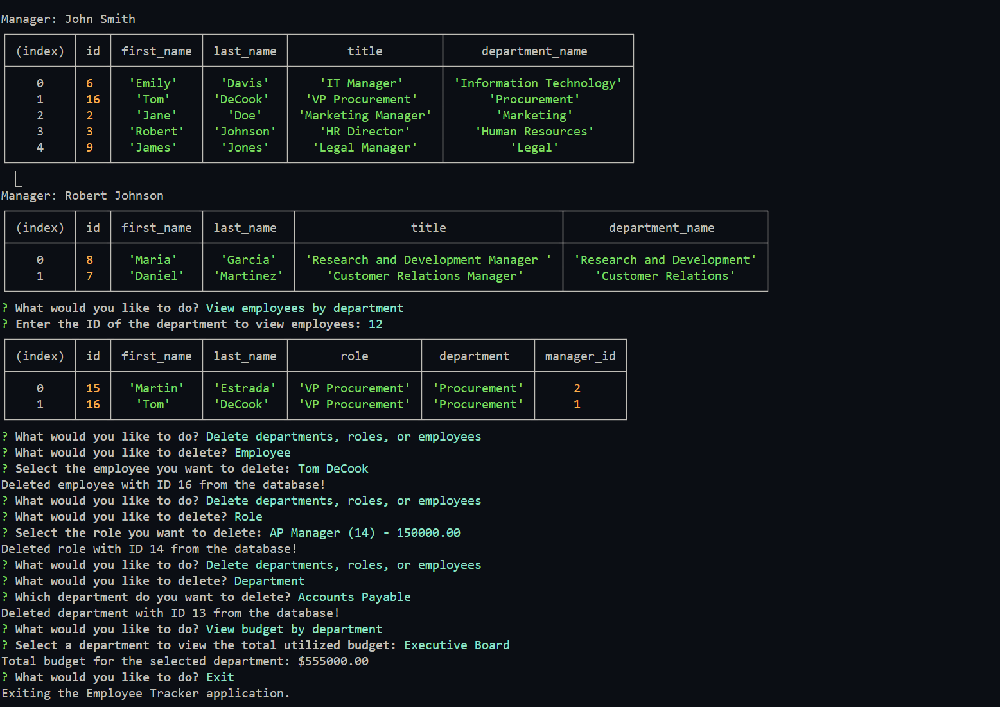
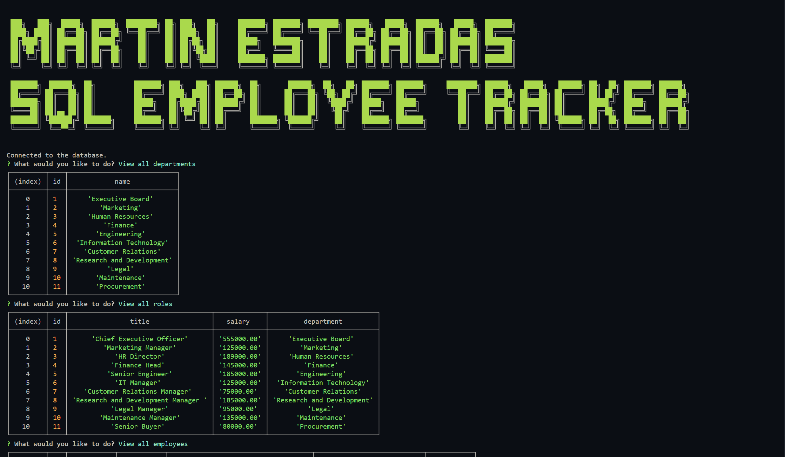

# Employee-Tracker

## Description

## User Story

```md
AS A business owner
I WANT to be able to view and manage the departments, roles, and employees in my company
SO THAT I can organize and plan my business
```

## Acceptance Criteria

```md
GIVEN a command-line application that accepts user input
WHEN I start the application
THEN I am presented with the following options: view all departments, view all roles, view all employees, add a department, add a role, add an employee, and update an employee role
WHEN I choose to view all departments
THEN I am presented with a formatted table showing department names and department ids
WHEN I choose to view all roles
THEN I am presented with the job title, role id, the department that role belongs to, and the salary for that role
WHEN I choose to view all employees
THEN I am presented with a formatted table showing employee data, including employee ids, first names, last names, job titles, departments, salaries, and managers that the employees report to
WHEN I choose to add a department
THEN I am prompted to enter the name of the department and that department is added to the database
WHEN I choose to add a role
THEN I am prompted to enter the name, salary, and department for the role and that role is added to the database
WHEN I choose to add an employee
THEN I am prompted to enter the employee’s first name, last name, role, and manager, and that employee is added to the database
WHEN I choose to update an employee role
THEN I am prompted to select an employee to update and their new role and this information is updated in the database 
```

## Link to Google Drive

  The following video shows an example of the application being used from the command line:

  [](https://drive.google.com/)

  ## Screenshot

  The following image shows the README application's appearance and functionality:

  
  
  ## Table of Contents
  - [Description](#description)
  - [User Story](#user-story)
  - [Acceptance Criteria](#acceptance-criteria)
  - [Link to Google Drive](#link-to-google-drive)
  - [Screenshot](#screenshot)
  - [Installation](#installation)
  - [Usage](#usage)
  - [License](#license)
  - [Tests](#tests)
  - [Questions](#questions)

## Installation

## Usage

## License
[](https://opensource.org/licenses) This project is licensed under the MIT License.

 ## Questions
If you have any questions or encounter any issues, please feel free to [open an issue](https://github.com/mxrtinee/Employee-Tracker/issues) or contact me directly:<br>
GitHub: [Mxrtinee](https://github.com/Mxrtinee)<br>
Email: [hello@martinestrada.dev](mailto:hello@martinestrada.dev)